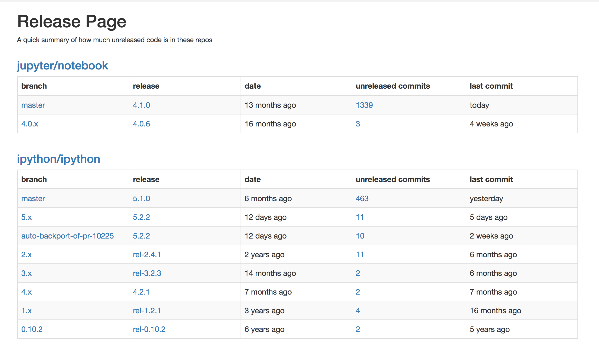

# Release Page

A simple service to render a webpage summarizing the release status of a
collection of repos on GitHub.

## Run

Install dependencies:

    pip3 install -r requirements.txt

Select repositories by editing `release-page.yml`

Run the service:

    python3 release-page

Or run with docker (again, after editing release-page.yml):

    docker build -t release-page .
    docker run -d -p 80:8888 release-page

## GitHub and rate limiting

To avoid being rate limited by GitHub, you can use a GitHub token. Copy the
token to:

    GITHUB_API_TOKEN='xxxxxxxxxxxxxxxxxx'

## Customization

Edit `release-page.yml` to set orgs and repos.

License: MIT
